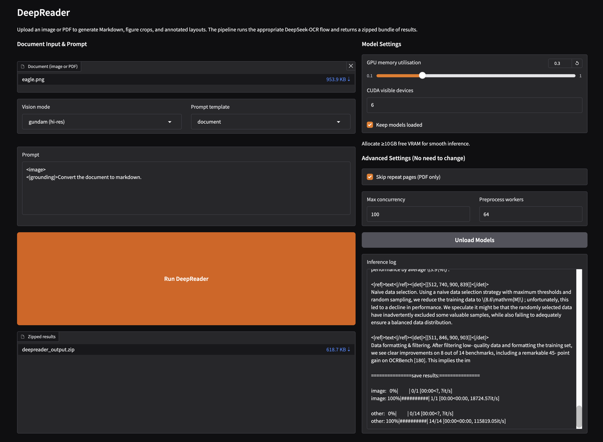

# DeepReader

[](assets/deepreader_logo.png)

DeepReader is an agentic reading toolkit that couples DeepSeek-OCR with opinionated defaults for running single-document or batch OCR. It streamlines image/PDF ingestion, produces Markdown accompanied by figure crops and layout previews, and exposes knobs for both CLI and Gradio workflows.


## Project Layout

- `images/`: Sample page images for quick smoke-tests.
- `docs/`: Input PDFs for full-length papers.
- `outputs/`: Generated Markdown, annotated images, and layout PDFs.
- `DeepSeek-OCR-master/DeepSeek-OCR-vllm/`: vLLM-powered runtime (default entry points).

## Environment Setup

- download the vllm-0.8.5 [whl](https://github.com/vllm-project/vllm/releases/tag/v0.8.5) 

```bash
conda create -n deepreader python=3.12.9 -y
conda activate deepreader
pip install torch==2.6.0 torchvision==0.21.0 torchaudio==2.6.0 \
  --index-url https://download.pytorch.org/whl/cu118
pip install vllm-0.8.5+cu118-cp38-abi3-manylinux1_x86_64.whl
pip install -r requirements.txt
```

Optional extras:

- `pip install flash-attn==2.7.3 --no-build-isolation` (faster attention if supported).

## Configuration Strategy

`DeepSeek-OCR-vllm/config.py` reads all defaults from environment variables, making it easy to swap inputs, outputs, prompts, or GPU settings without editing code.

```bash
export DEEPREADER_INPUT_PATH="$PWD/docs/paper.pdf"
export DEEPREADER_OUTPUT_PATH="$PWD/outputs/paper_run"
export DEEPREADER_PROMPT='<image>
<|grounding|>Convert the document to markdown.'
export DEEPREADER_PROMPT_TEMPLATE=document
export DEEPREADER_MODE=gundam
export DEEPREADER_CUDA_VISIBLE_DEVICES=0
export DEEPREADER_GPU_MEM_UTIL=0.8
export DEEPREADER_KEEP_MODELS_LOADED=1
```

>**GPU tip**: the default vLLM config assumes ≈10 GB of free VRAM. Tune `DEEPREADER_GPU_MEM_UTIL` down if you’re memory-constrained.

## Gradio Interface

[](assets/interface.png)

Launch an interactive UI that accepts image or PDF uploads and returns a zipped bundle (Markdown, annotated layouts, figure crops):

```bash
python run_deepreader_gradio.py --host 0.0.0.0 --port 10086 --no-browser
```

Features:

- Upload image/PDF from the left column, pick a vision mode (`base` or `gundam (hi-res)`), and select a prompt template.
- Backend device selection, concurrency, and GPU memory utilisation follow the `DEEPREADER_*` environment variables.
- Use “Unload Models” to free the shared vLLM engine and release GPU memory between runs.
- Mixed workloads (single images + PDFs) share one GPU via the unified concurrency helper used by the Gradio backend, so simultaneous users no longer block each other.
- A Gradio queue is enabled by default to cap concurrency and reject excessive load; tune it with `--queue-concurrency`, `--queue-max-size`, or disable via `--no-queue` if you need raw FastAPI behavior.
- Gradio keeps only the latest 20 sessions and drops anything older than 24 hours, so `outputs/gradio_sessions/` stays tidy.
- Each run produces a ZIP bundle (`result.mmd`, figures, annotated layouts, logs) ready for download.

Use the prompt-template dropdown to populate the textbox with a preset and tweak the prompt before running. Advanced runtime knobs—CUDA device list, concurrency, worker counts, GPU memory fraction, repeat filtering, and cache retention—are controlled via environment variables or CLI flags (see the sections below). Each run creates a session under `outputs/gradio_sessions/`, and the downloaded archive also includes a `gradio_run.log` with console output. Use `--port` to pick a different port, `--share` for public links, `--no-queue` if you prefer immediate FastAPI calls, adjust the guardrails with `--queue-concurrency` / `--queue-max-size`, and `--allow-path <dir>` to expose extra directories for downloads if needed.

>**Note**: plan for ≈10 GB of free VRAM for the default gundam (hi-res) mode. Lower `DEEPREADER_GPU_MEM_UTIL` or the corresponding CLI flag if your GPU has less headroom.


### Vision Modes


| Mode | Base Size | Image Size |	Crop Mode |	Notes |
|-|-|-|-|-|
| `base` |	1024	| 1024 |	False	| Standard quality |
| `gundam (hi-res)` |	1024 |	640	| True |	Dynamic high-res crops (default) |

Switch via `--mode` (CLI), the Gradio dropdown, or `DEEPREADER_MODE`.


### Prompt Templates

Named templates keep prompts consistent across runs:

- `document`: `<image>\n<|grounding|>Convert the document to markdown.`
- `other_image`: `<image>\n<|grounding|>OCR this image.`
- `without_layouts`: `<image>\nFree OCR.`
- `figures`: `<image>\nParse the figure.`
- `general`: `<image>\nDescribe this image in detail.`
- `rec`: `<image>\nLocate <|ref|>xxxx<|/ref|> in the image.`

Select them via the template dropdown/CLI flag/env var, or exceed with a custom `--prompt`.


## Image OCR Pipeline (CLI)

```bash
python DeepSeek-OCR-master/DeepSeek-OCR-vllm/run_dpsk_ocr_image.py \
  --input ./images/sample.png \
  --output ./outputs/sample_image_run \
  --mode gundam \
  --prompt-template figures \
  --prompt '<image>\n<|grounding|>Convert the document to markdown.' \
  --gpu-memory-util 0.8 \
  --cuda-visible-devices 0 \
  --keep-model-loaded true
```

Outputs:

- `result.mmd`: Markdown transcription with resolved image crops.
- `result_with_boxes.jpg`: Annotated source page.
- `images/*.jpg`: Extracted figure crops.
- `geo.jpg` (conditional): Geometry reconstruction if the model returns structured line data.

## PDF OCR Pipeline (CLI)

```bash
cd DeepSeek-OCR-master/DeepSeek-OCR-vllm
python run_dpsk_ocr_pdf.py \
  --input ../../docs/paper.pdf \
  --output ../../outputs/paper_pdf_run \
  --mode gundam \
  --prompt-template document \
  --max-concurrency 4 \
  --gpu-memory-util 0.8 \
  --cuda-visible-devices 0 \
  --keep-model-loaded true \
  --pdf-render-dpi 144 \
  --pdf-annot-dpi 320
```

You'll get:

- `<paper>_det.mmd`: Raw model output with detection tags.
- `<paper>.mmd`: Cleaned Markdown with inline image references.
- `<paper>_layouts.pdf`: Original PDF with lightweight vector overlays for bounding boxes (no re-rasterized pages).
- `images/`: page-level crops.
- `--pdf-annot-dpi` (or `DEEPREADER_PDF_ANNOT_DPI`) renders a second, higher-resolution pass dedicated to bounding boxes and figure crops, so exported images stay sharp even if the model runs on downsampled pages. Adjust `--pdf-render-dpi` (`DEEPREADER_PDF_RENDER_DPI`) to trade off VRAM usage vs. per-page fidelity during inference.
- Layout overlays edit the source PDF in place, so the boxed variant stays compact even when using high annotation DPI values.

Disable repeat filtering with `--skip-repeat false` if you need every page’s raw output.

For single-GPU concurrent inference, tune `--max-concurrency` (or `DEEPREADER_MAX_CONCURRENCY`) to bound how many vLLM requests can run in parallel. The PDF pipeline now dispatches batched generations through the shared `AsyncLLMEngine`, so multiple pages—or queued user runs from Gradio—share one GPU without blocking each other.

### Mixed Image/PDF Concurrency

When you need to process standalone images and PDF documents at the same time, reach for `DeepSeek-OCR-master/DeepSeek-OCR-vllm/mixed_runner.py`:

```python
from DeepSeek-OCR-master.DeepSeek-OCR-vllm.mixed_runner import run_mixed_image_pdf

result = run_mixed_image_pdf(
    image_requests=[
        {"input": "./images/sample.png", "output": "./outputs/sample_mix_a"},
        {"input": "./images/sample2.png", "output": "./outputs/sample_mix_b"},
    ],
    pdf_requests=[
        {"input": "./docs/paper.pdf", "output": "./outputs/paper_mix"},
    ],
    max_concurrency=4,
    cuda_visible_devices="0",
)

print(result["image_results"][0])
print(result["pdf_results"][0]["mmd_path"])
```

The helper merges both pipelines, shares a single `AsyncLLMEngine`, and respects per-request overrides (prompt, crop mode, skip-repeat). Tune concurrency, CUDA devices, GPU memory, and cache behaviour either via keyword arguments or the `DEEPREADER_*` environment variables. The return payload mirrors image transcripts and PDF artifact paths so higher-level services can dispatch outputs to the correct clients.

## Changelog

| Version | Date       | Highlights |
|---------|------------|------------|
| 0.2.4   | 2025-12-10 | PDF preprocessing/postprocessing now thread-parallel. |
| 0.2.3   | 2025-11-12 | PDF annotations now draw translucent vector overlays directly on the source file, keeping `*_layouts.pdf` tiny while preserving labels. |
| 0.2.2   | 2025-11-07 | Added queue toggles plus PDF render/annotation DPI controls for sharper crops without extra VRAM. |
| 0.2.1   | 2025-11-06 | Streamlined Gradio UI with backend-driven defaults and a shared unload helper. |
| 0.2.0   | 2025-11-06 | Introduced mixed image/PDF concurrency on a single `AsyncLLMEngine`. |
| 0.1.0   | 2025-11-04 | Initial release with shared vLLM cache, prompt presets, and session cleanup. |


## Troubleshooting

- **GPU capability errors**: ensure `CUDA_DEVICE_ORDER=PCI_BUS_ID` (automatically set) and specify a single `--cuda-visible-devices` index.
- **Low VRAM**: reduce `--gpu-memory-util` (e.g., 0.6) or use `base` mode.
- **NVML InvalidArgument**: usually indicates pointing to a non-existent GPU index; double-check the selected CUDA device.


## License & Contributions
This repo mirrors [DeepSeek-OCR](https://github.com/deepseek-ai/DeepSeek-OCR) OSS code plus integration glue. Follow upstream licensing for model usage. Contributions welcome—please use Conventional Commit messages (`feat: ...`, `fix: ...`) and include CLI examples/VRAM notes in PR descriptions.
